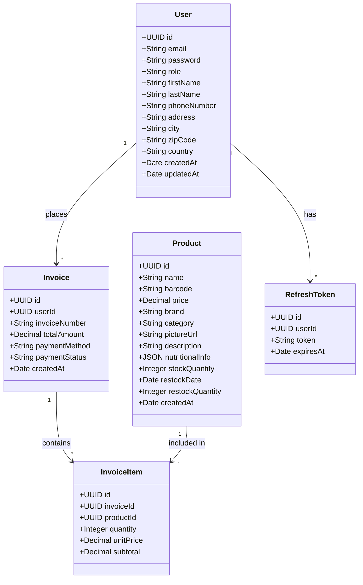
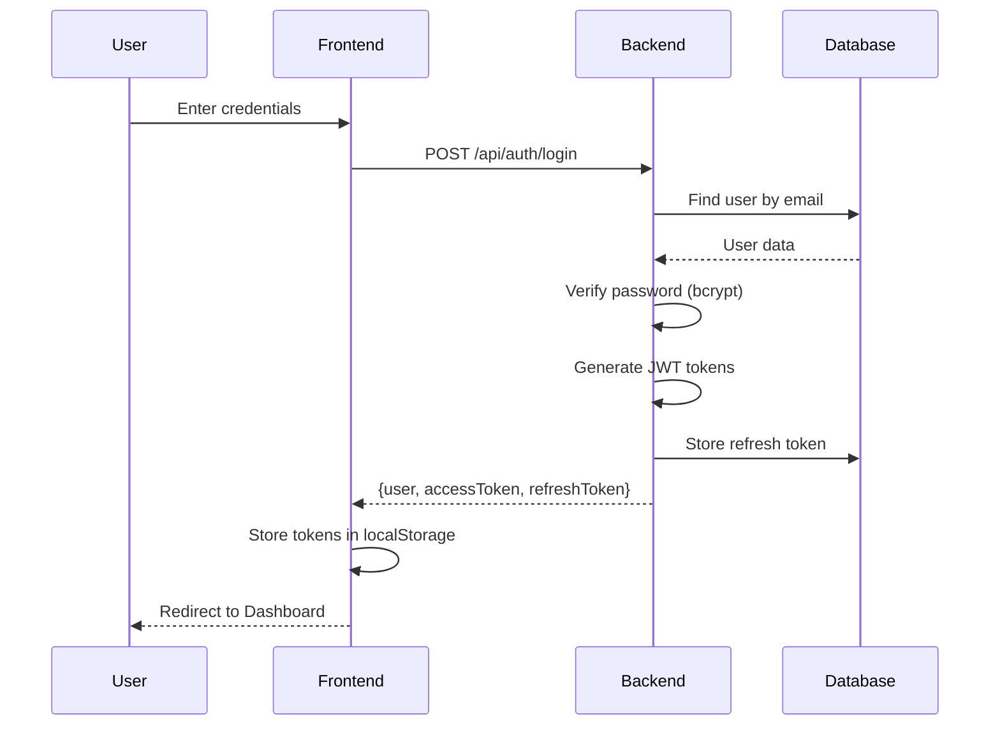
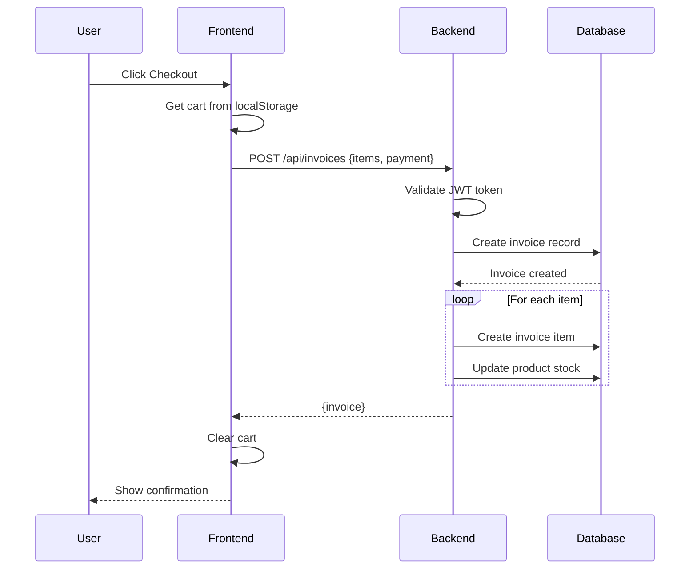
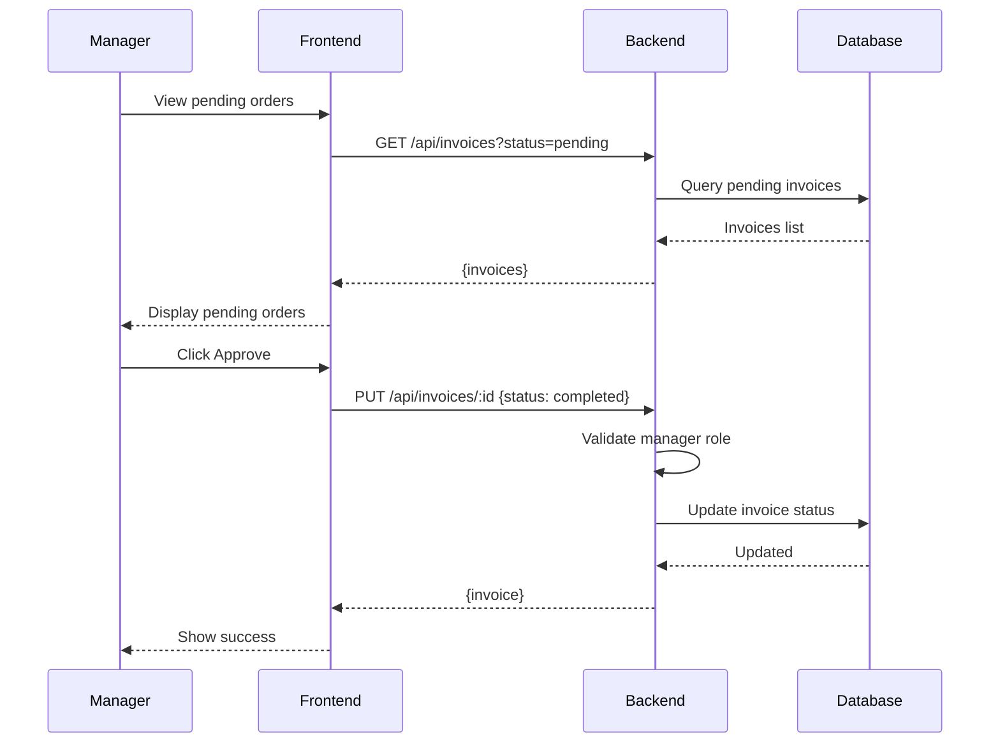
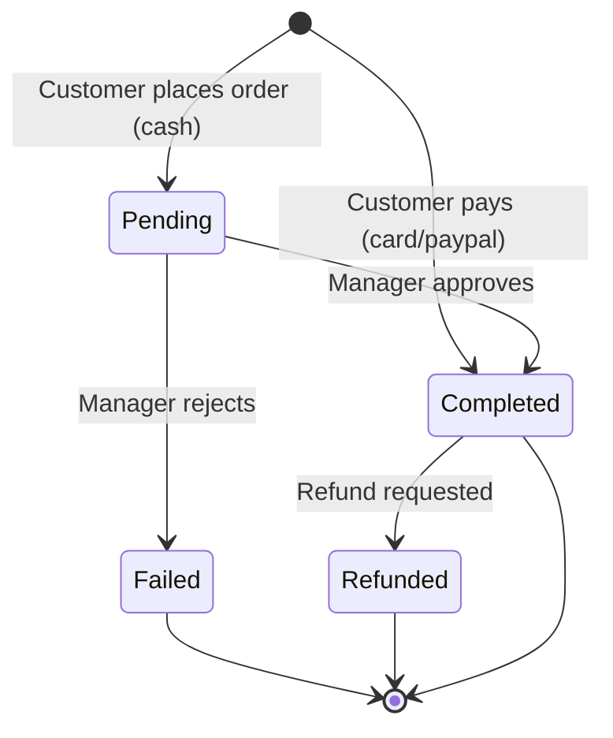
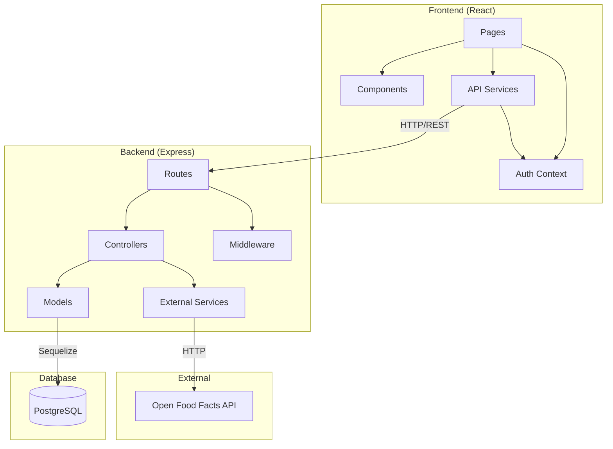
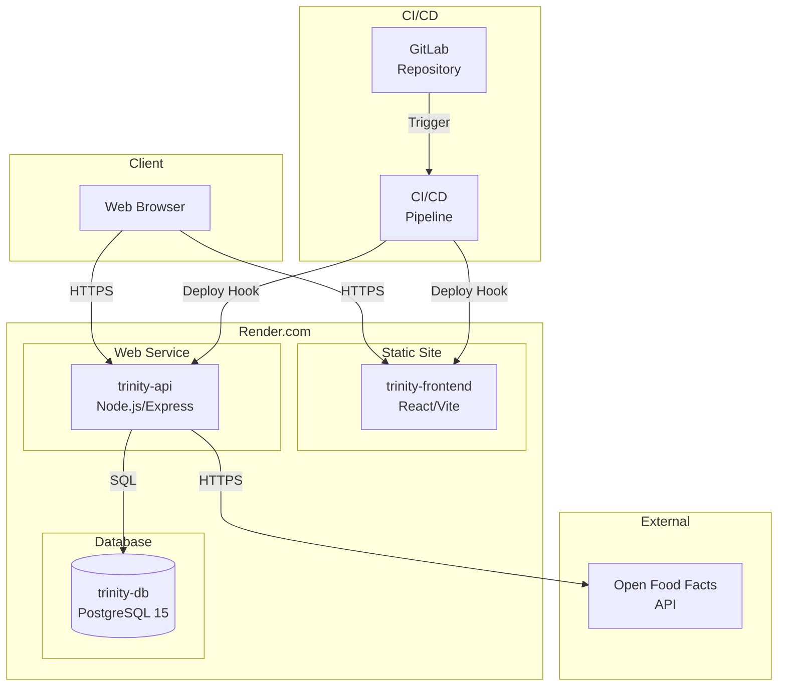
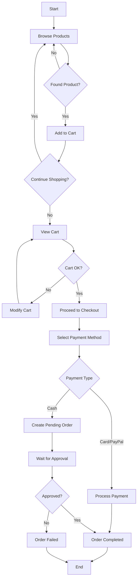

# Trinity Grocery - UML Diagrams

## Use Case Diagram

```mermaid
graph TB
    subgraph Actors
        C[Customer]
        E[Employee]
        M[Manager]
        A[Admin]
    end

    subgraph "Customer Actions"
        UC1[Browse Products]
        UC2[Search Products]
        UC3[Add to Cart]
        UC4[Checkout]
        UC5[View Orders]
        UC6[Register/Login]
    end

    subgraph "Employee Actions"
        UC7[View All Orders]
        UC8[View Inventory]
        UC9[Process Orders]
    end

    subgraph "Manager Actions"
        UC10[Manage Products]
        UC11[Approve Cash Orders]
        UC12[View Reports]
        UC13[Import from OFF]
    end

    subgraph "Admin Actions"
        UC14[Manage Users]
        UC15[Assign Roles]
    end

    C --> UC1
    C --> UC2
    C --> UC3
    C --> UC4
    C --> UC5
    C --> UC6

    E --> UC1
    E --> UC7
    E --> UC8
    E --> UC9

    M --> UC7
    M --> UC8
    M --> UC10
    M --> UC11
    M --> UC12
    M --> UC13

    A --> UC14
    A --> UC15
    A --> UC10
    A --> UC12
```

## Class Diagram

## Sequence Diagram - User Login

## Sequence Diagram - Place Order

## Sequence Diagram - Manager Approves Order

## State Diagram - Order Status

## Component Diagram

## Deployment Diagram

## Activity Diagram - Shopping Flow

